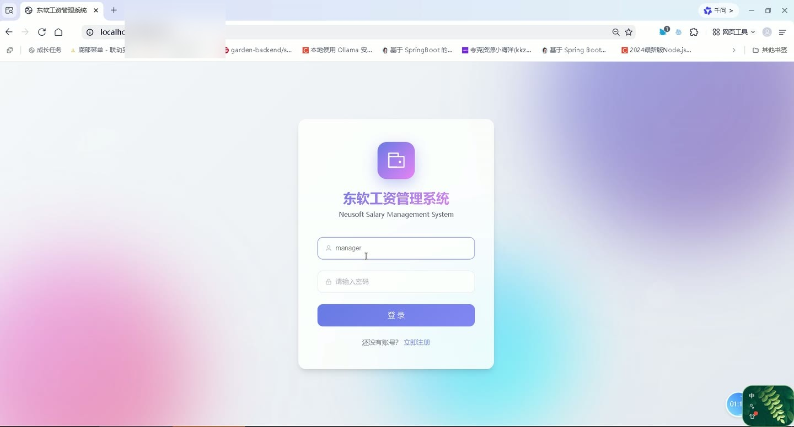
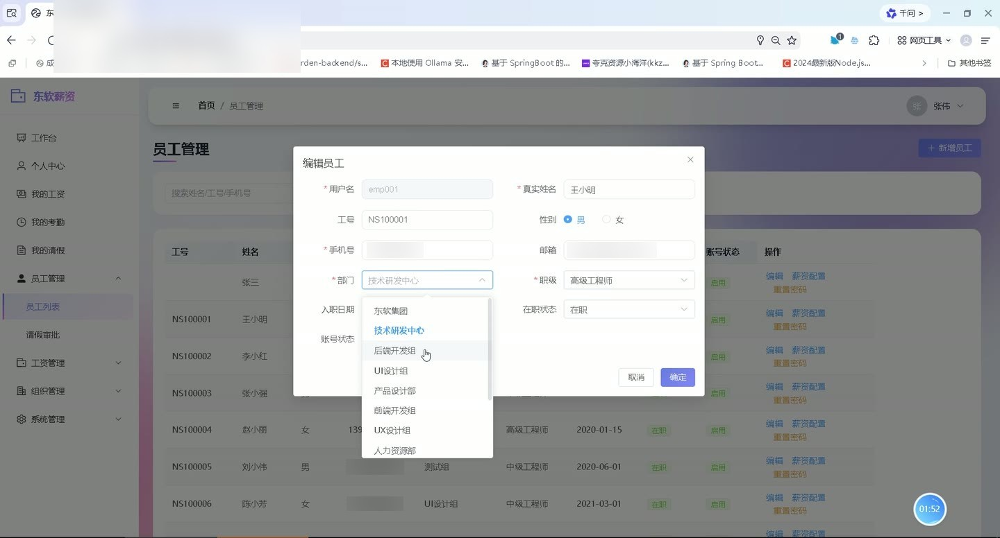
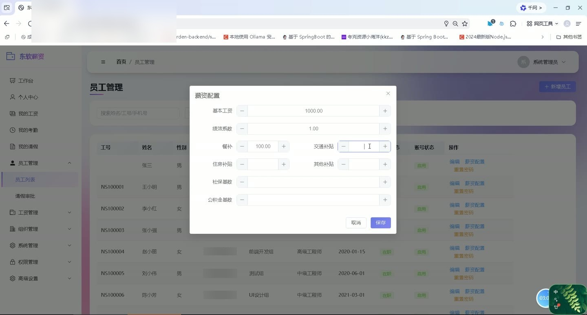
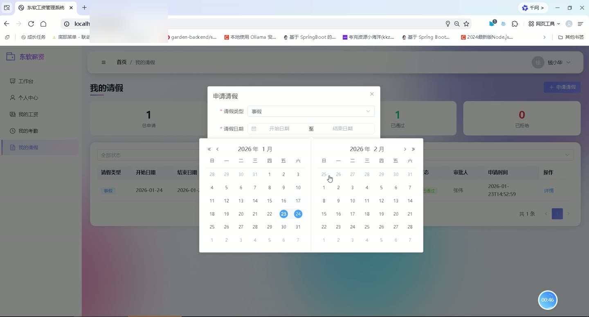
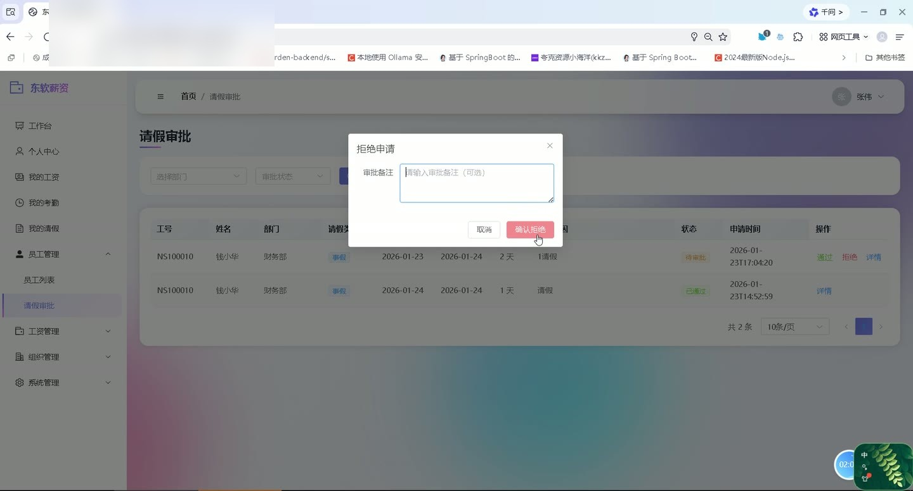
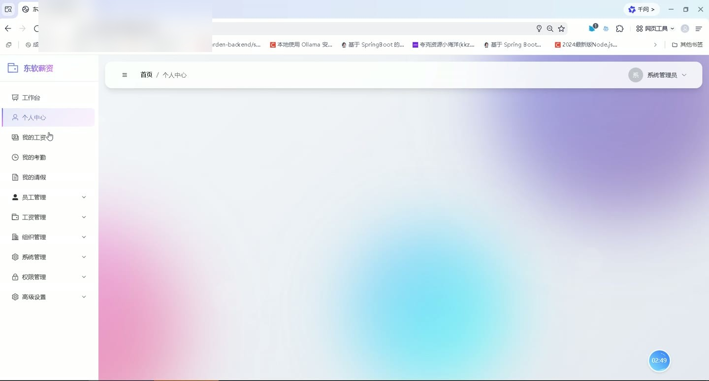

# (附文档)Springboot3+Vue3+MySQL 工资管理系统

**技术栈**：Springboot3、Vue3、MySQL

### 系统简介

本系统是一套基于 Spring Boot 3 + Vue 3 + MySQL 的企业级工资管理平台，采用前后端分离架构。系统涵盖员工考勤打卡、请假审批、薪资核算与发放、组织结构管理、角色权限控制、公告通知等核心业务模块，支持普通员工与管理员双角色操作，满足企业日常人事与薪酬管理需求。
 
### 核心功能
 
### 普通用户端

 
- 上下班打卡：点击"打卡上班"记录上班时间，点击"打卡下班"记录下班时间，系统自动判断迟到/早退/加班状态 
- 查看今日考勤：获取当日打卡状态、打卡时间、工作时长等数据 
- 查看考勤列表：分页查看个人考勤记录，支持按日期范围筛选 
- 查看月度考勤统计：选择年月，查看当月出勤天数、迟到天数、早退天数、缺勤天数、加班时长等汇总数据 
- 提交请假申请：选择请假类型（事假/病假/年假/婚假/产假/丧假/调休）、起止日期、请假原因，系统自动计算请假天数 
- 查看请假记录：分页查看个人请假申请列表，支持按审批状态筛选 
- 撤回请假申请：对"待审批"状态的申请可执行撤回操作 
- 查看工资记录：查看个人历史工资单，包含基本工资、绩效、各项补贴、加班费、个税、社保、实发工资等明细 
- 查看个人薪资配置：查看自己的基本工资、绩效比例、餐补、交通补贴、住房补贴等配置信息 
- 修改个人资料：更新个人基本信息（姓名、手机、邮箱、头像等） 
- 修改登录密码：输入原密码和新密码完成密码修改 
- 查看公告列表：浏览已发布的系统公告（按优先级和时间排序） 
- 查看公告详情：点击公告标题查看完整内容 
- 查看轮播图：浏览前台展示的轮播广告图片
 
### 管理员端

 
- 用户管理：分页查询用户列表，支持按关键字/部门/用户类型筛选；新增、编辑、删除用户；重置用户密码为 123456 
- 部门管理：以树形结构查看所有部门；新增、编辑、删除部门（超级管理员可删除）；设置部门负责人、联系电话、排序号 
- 岗位管理：分页查询岗位列表；新增、编辑、删除岗位（超级管理员可删除）；设置岗位名称、编码、级别 
- 考勤管理：分页查看所有员工的考勤记录，支持按用户/日期范围筛选 
- 请假审批：分页查看所有员工的请假申请，支持按部门/状态筛选；审批通过或拒绝，填写审批备注；审批通过后自动更新对应日期的考勤状态为"请假" 
- 薪资配置管理：为每位员工设置薪资配置（基本工资、绩效比例、餐补、交通补贴、住房补贴、其他补贴、社保基数、公积金基数、课时费） 
- 薪资核算：对指定员工按月份进行工资核算，系统自动读取考勤统计、薪资配置、系统参数计算应发/扣款/实发；支持批量核算 
- 薪资发放：对已核算的工资记录执行发放操作，标记发放状态与发放时间 
- 薪资查询：分页查看所有工资记录，支持按关键字/部门/月份/核算状态/发放状态筛选 
- 薪资统计：查看各部门薪资汇总（部门总实发、平均实发等）；查看全公司薪资汇总（总应发、总扣款、总实发、人数等） 
- 公告管理：新增、编辑、删除公告；手动发布公告（设置发布时间）；支持设置公告类型、优先级、过期时间 
- 轮播图管理：新增、编辑、删除轮播图；设置轮播图标题、图片、链接、排序、展示位置（前台/后台）、启用状态 
- 节假日管理：按年份查看节假日列表；新增、编辑、删除节假日（用于考勤计算） 
- 角色管理：分页查询角色列表；新增、编辑、删除角色（超级管理员权限）；为角色分配权限（勾选权限树） 
- 权限管理：以树形结构查看所有权限；新增、编辑、删除权限（超级管理员权限）；设置权限名称、编码、路由、图标、排序 
- 系统参数配置：按类型查看系统配置（如社保比例、税率起征点等）；新增、编辑、删除配置项（超级管理员权限） 
- 操作日志查询：分页查看系统操作日志，支持按关键字/日期范围筛选（仅超级管理员）
 
### 技术栈

 后端框架Spring Boot 3 ORMMyBatis-Plus 权限认证Spring Security + JWT + Redis 前端框架Vue 3 状态管理Pinia 构建工具Vite 数据库MySQL 文件上传本地文件存储
 
### 交付内容

 
- 后端完整源码 
- 前端完整源码 
- 数据库初始化脚本 
- 万字文档

## 界面展示

---

## 获取完整源码 + 万字文档

本仓库为项目介绍页。**完整前后端源码、数据库初始化脚本、万字项目文档**，请访问 [codekk.top](http://codekk.top) 获取。

可作课程设计 / 毕业设计参考，支持远程部署调试。